# Workshop estate GIS 2022 UNIPD

---

**INDICE**

<!-- TOC -->

- [Workshop estate GIS 2022 UNIPD](#workshop-estate-gis-2022-unipd)
  - [Titolo](#titolo)
  - [Relatore](#relatore)
  - [Data, luogo e durata](#data-luogo-e-durata)
  - [Piattaforme e Software](#piattaforme-e-software)
  - [Programma](#programma)
  - [QGIS e il WMS AdE](#qgis-e-il-wms-ade)
  - [link utili](#link-utili)
  - [Contatti](#contatti)
    - [Totò Fiandaca](#totò-fiandaca)
- [Workshop WMS Catasto (riepilogo 2021)](#workshop-wms-catasto-riepilogo-2021)
  - [Servizio WMS](#servizio-wms)
    - [Come aggiungere il Servizio WMS a QGIS](#come-aggiungere-il-servizio-wms-a-qgis)
    - [Quali dati espone il servizio WMS](#quali-dati-espone-il-servizio-wms)
  - [Espressione personalizzata](#espressione-personalizzata)
  - [campi virtuali](#campi-virtuali)
  - [Digitalizzazione particelle](#digitalizzazione-particelle)
    - [Plugin GIMP Selection Feature](#plugin-gimp-selection-feature)
      - [Workflow](#workflow)
    - [Plugin Magic Wand](#plugin-magic-wand)
      - [Workflow](#workflow-1)
    - [estrarre dati dai poligoni](#estrarre-dati-dai-poligoni)
- [Workshop EstateGIS 2022](#workshop-estategis-2022)
  - [estrarre dati lungo linee](#estrarre-dati-lungo-linee)
  - [Modellatore grafico](#modellatore-grafico)
  - [Disegno CAD Avanzato](#disegno-cad-avanzato)
  - [Plugin Cadastral Divisions](#plugin-cadastral-divisions)
  - [Stampa](#stampa)
- [Cosa occorre](#cosa-occorre)
  - [Software da installare](#software-da-installare)
  - [Plugin da installare](#plugin-da-installare)
- [RISULTATI EVENTO](#risultati-evento)
  - [DOMANDE](#domande)
- [Riferimenti utili](#riferimenti-utili)
- [Cosa c'è in questo repo](#cosa-cè-in-questo-repo)
- [Video demo](#video-demo)
- [Licenza](#licenza)
  - [Prossimi eventi](#prossimi-eventi)

<!-- /TOC -->

---

## Titolo

**TITOLO**: <br> Dal CAD al GIS: Mappe Catastali, disegno CAD e Tavole di Progetto.

**DESCRIZIONE**: <br> Hai mai utilizzato funzioni avanzate per utilizzare QGIS come un software CAD? Avanziamo con un flusso di lavoro che parte dallo straordinario contributo di Salvatore Fiandaca (pigrecoinfinito.com) per la gestione delle particelle catastali e avanza con l'obiettivo di condividere skills aggiundive in QGIS. Una demo per imparare a disegnare e progettare proprio come un CAD per poi proseguire con composizione di stampa avanzata.

<p align="center"><a href="https://www.mastergiscience.it/2022/05/05/estate-gis-2022/" target="_blank">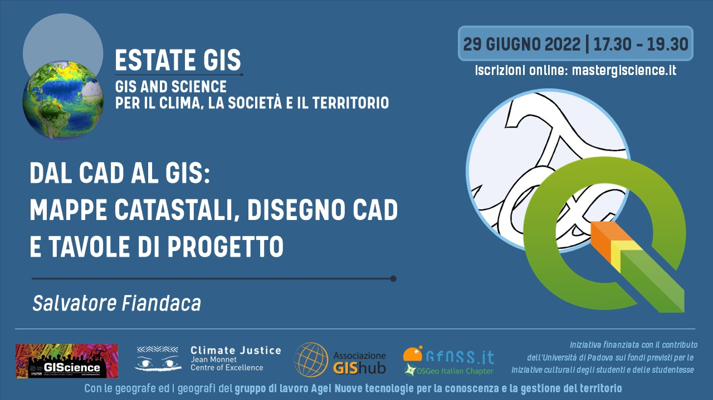</a></p>

---

[](https://github.com/pigreco/seminario-estate-gis-2020/blob/master/license)
[](https://github.com/pigreco/seminario-estate-gis-2020/commits/master)

## Relatore

- 👨‍🦲 **Totò FIANDACA** <br>(Membro [OpenDataSicilia](http://opendatasicilia.it/) (2014) , Membro [QGIS Italia](http://qgis.it/) (2015), Socio [GFOSS.it](https://gfoss.it/) (2017), Membro [QGIS organization](https://github.com/qgis) (2020))

## Data, luogo e durata

- 🗓 29/06/2022 con orario 🕟 17:30 🕢 19:30 
- 🌐 on-line
- ⏳ 2️⃣ ore

## Piattaforme e Software

- [ZOOM](https://zoom.us/) - per diretta web
- Windows 10 64b - come SO
- [`QGIS 3.24 Tisler`](https://qgis.org/it/site/)  e Plugin [`Gimp Selection feature`](https://github.com/lmotta/gimpselectionfeature_plugin/wiki) e [`Magic Wand`](https://plugins.qgis.org/plugins/MagicWand-master/)
- GIMP 2.10 

## Programma

1. Presentazione iniziale da parte degli organizzatori;
2. Rapida illustrazione del Workshop Estate 2021
3. Workshop Estate 2022
    1. Estrarre i dati catastali lungo un tracciato stradale;
    2. Modellatore grafico;
    3. Disegno CAD avanzato;
    4. Plugin Cadastral Divisions per il frazionamento;
    5. Stampa tracciato e lista delle particelle.

[↑ torna su ↑](#workshop-estate-gis-2022-unipd)

## QGIS e il WMS AdE

<p align="center"><a href="https://qgis.org/it/site/" target="_blank">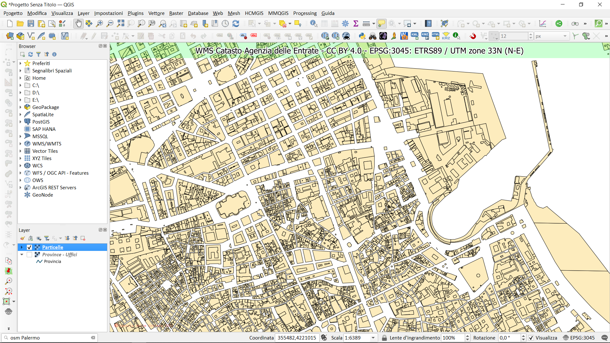</a></p>


[↑ torna su ↑](#workshop-estate-gis-2020-unipd)

## link utili

- **URL servizio WMS** : https://wms.cartografia.agenziaentrate.gov.it/inspire/wms/ows01.php
- **PDF su WMS** : <https://www.agenziaentrate.gov.it/portale/documents/20143/260417/Manuale+consultazione+cartografia_Documentazione+descrittiva+del+servizio+di+consultazione+della+cartografia+catastale+20180611.pdf/35e955f7-2344-56c8-1157-8f7567531660>
- **Capabilities** : <https://wms.cartografia.agenziaentrate.gov.it/inspire/wms/ows01.php?SERVICE=WMS&VERSION=1.3.0&REQUEST=GetCapabilities>
- **Pagina con URL e licenza** : https://www.agenziaentrate.gov.it/portale/web/guest/schede/fabbricatiterreni/consultazione-cartografia-catastale/servizio-consultazione-cartografia
- **espressione personalizzata**: <https://gist.github.com/pigreco/86589dddf5a59b3a7650267d5af237bd>

---

## Contatti

### Totò Fiandaca

* ✉ **Mail**: <pigrecoinfinito@gmail.com>
* **Twitter**: <https://twitter.com/totofiandaca>
* **Canale Telegram**: <https://t.me/pigrecoinfinito>

---

# Workshop WMS Catasto (riepilogo 2021)

## Servizio WMS

### Come aggiungere il Servizio WMS a QGIS

1. URL: `https://wms.cartografia.agenziaentrate.gov.it/inspire/wms/ows01.php`
2. Gestione delle Sorgenti dati | WMS/WMTS | Nuovo :

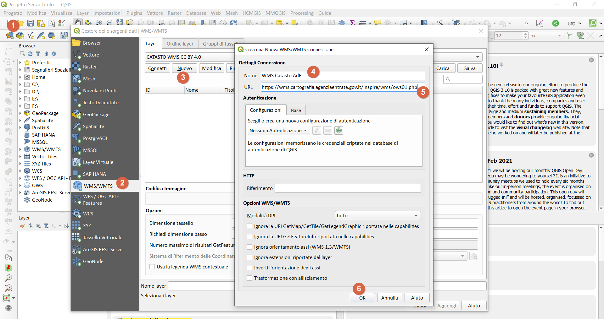

<https://geoportale.cartografia.agenziaentrate.gov.it/age-inspire/srv/ita/catalog.search;jsessionid=2D812F23AA0C878D6F2DE54F9CE259CB.node1#/home>

### Quali dati espone il servizio WMS

1. codice Belfiore;
2. foglio;
3. particella;
4. sezione;
5. allegato;
6. sviluppo

[↑ torna su ↑](#workshop-estate-gis-2022-unipd)

## Espressione personalizzata

Questa espressione personalizzata permette di estrarre i dati esposti dal WMS Catasto

```python
# -*- coding: utf-8 -*-
"""
/***************************************************************************
 WMS Catasto Agenzia delle Entrate CC BY 4.0
                              -------------------
        copyright            : (C) 2020 by Giulio Fattori
        email                : xxxx.xxxxx@tin.it
 ***************************************************************************/
"""

from qgis.core import *
from qgis.gui import *
import requests

@qgsfunction(args='auto', group='Custom')
def get_parcel_info2(xx, yy, EPSG, feature, parent):
    """
    <h1>WMS Catasto Agenzia delle Entrate CC BY 4.0:</h1><br>    
    La funzione, tramite una richiesta GetFeatureInfo, restituisce le informazioni utili sulla particella che ricade sotto il pixel di mio interesse:
    <h2>Esempio:</h2>
    <ul>
      <li>get_parcel_info2(355461.5,4222490.7,'EPSG:3045') -> 'IT.AGE.PLA.G273_0033A0.673'</li>
      <li>get_parcel_info2("fieldX", "fieldY",'EPSG:3045') -> 'IT.AGE.PLA.G273_0033A0.673'</li>
      <li>get_parcel_info2("fieldX", "fieldY",@project_crs) -> 'IT.AGE.PLA.G273_0033A0.673'</li>
    </ul>
    <h2>NB: le coordinate X e Y devono essere espresse nel EPSG utilizzato (gli EPSG disponibili sono:25832/3/4,3044/5/6)</h2>
    """
    req = "https://wms.cartografia.agenziaentrate.gov.it/inspire/wms/ows01.php?REQUEST=GetFeatureInfo&SERVICE=WMS&SRS="+EPSG+"&STYLES=&VERSION=1.1&FORMAT=image/png&BBOX="+str(xx-1)+","+str(yy-1)+","+str(xx+1)+","+str(yy+1)+"&HEIGHT=9&WIDTH=9&LAYERS=CP.CadastralParcel&QUERY_LAYERS=CP.CadastralParcel&INFO_FORMAT=text/html&X=5&Y=5"

    r = requests.get(req, auth=('user', 'pass'))
    a = r.text.partition("InspireId localId</th><td>")[2]
    b = a.partition("</td>")[0]
    return b
```

file da salvare nella cartella del profilo corrente: `C:\Users\nomeUtente\AppData\Roaming\QGIS\QGIS3\profiles\default\python\expressions`

raggiungibile da : Menu | Impostazioni | Profilo utente | Apri la cartella del profilo attivo

<p align="center"><a href="https://qgis.org/it/site/" target="_blank">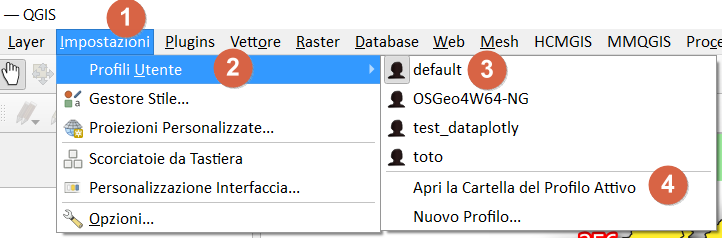</a></p>

la funzione personalizzata nel Gruppo Custom del field calc:

<p align="center"><a href="https://qgis.org/it/site/" target="_blank">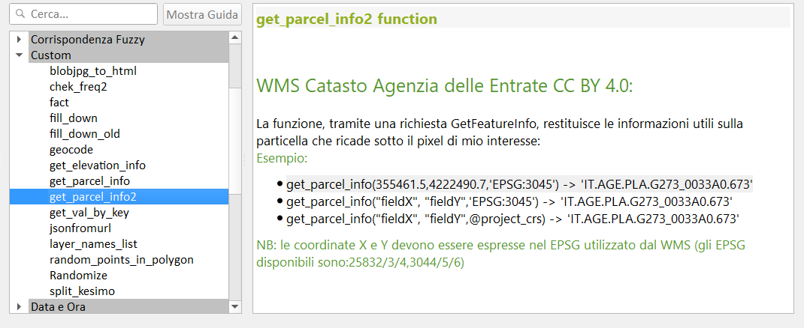</a></p>

[↑ torna su ↑](#workshop-estate-gis-2022-unipd)

## campi virtuali

sotto le espressioni utilizzate nei campi virtuali (i campi virtuali permettono di creare un layer con i campi popolati da espressioni)

Creare un vettore puntuale, per esempio in un GeoPackage e definire solo il campo `fid`, gli altri campi li definiamo come `campi virtuali`, ecco le definizioni:

nome campo | tipo campo | espressione | descrizione
-----------|------------|-------------|-----------
fid | automatico | - | generato dal GeoPackage
x | virtuale | `$x` | coordinata x del punto
y |virtuale | `$y` | coordinata y del punto
catasto | virtuale | `get_parcel_info2("x","y")`| funzione personalizzata
codice | virtuale | `regexp_replace("catasto",'^(.+)\\.(.+)\\.(.+)\\.(.+)_(.+)\\.(.+)$','\\4')` | estrazione codice Belfiore
foglio | virtuale | `regexp_replace("catasto",'^(.+)\\.(.+)\\.(.+)\\.(.+)_(.+)\\.(.+)$','\\5')` | nro foglio
particella | virtuale | `regexp_replace("catasto",'^(.+)\\.(.+)\\.(.+)\\.(.+)_(.+)\\.(.+)$','\\6')` | nro particella


## Digitalizzazione particelle

### Plugin GIMP Selection Feature

- **GIMP**: <https://www.gimp.org/>
- **Plugin**: <https://plugins.qgis.org/plugins/gimpselectionfeature_plugin/> 

#### Workflow

1. Avviare QGIS e installare il Plugin GIMP Selection Feature;
2. Avviare GIMP e verificare che ci siam un menu **IBAMA**;
3. Avviare il servizio dal menu IBAMA;
4. in QGIS caricare il WMS catasto AdE e posizionarsi in un'area;
5. Avviare il plugin da **Menu Raster**;
6. Comparirà la finestra del plugin agganciata sul lato destro dello schermo;
7. nel riquadro `Visible Images` ci sarà l'elenco dei layer raster caricati nella TOC e attivi;
8. dopo aver centrato l'area da digitalizzare nella map canvas: pigiare il bottone `Send image`;
9. dopo qualche secondo, l'immagine della map canvas apparirà in GIMP;
10. usare lo _Strumento seleziona fuzzy_ e cliccare dentro una particella;
11. da QGIS, pigiare sul bottone `Get feature` per acquisire area selezionata come poligono.

Per maggiori info: <https://github.com/lmotta/gimpselectionfeature_plugin/wiki>

### Plugin Magic Wand

- <https://plugins.qgis.org/plugins/MagicWand-master/>

#### Workflow

1. Impostare _Precisione_ e _Soglia_ colore e fare clic sulla mapcanvas dove si desidera creare un poligono;
2. La modalità singola ti consente di creare UN poligono intorno a dove hai cliccato.
3. Una maggiore precisione richiede più tempo.
4. Per rendere il poligono in modo appropriato, è meglio regolare alta la Saturazione.

NB: il poligono che restituisce ha lo stesso EPSG del Progetto.

[↑ torna su ↑](#workshop-estate-gis-2022-unipd)

### estrarre dati dai poligoni

nel caso di poligoni (che hanno un EPSG diversoda quello del WMS):

```
/*estrae il foglio e la particella catastale a partire da un poligono*/
/*con EPSG diverso da quello del WMS*/

with_variable('fp',
		with_variable('geom',
				transform($geometry,'EPSG:4326', @project_crs ),
				get_parcel_info2(
						x( point_on_surface( @geom)),
						y( point_on_surface( @geom)), @project_crs)),
	regexp_replace( @fp ,'^(.+)\\.(.+)\\.(.+)\\.(.+)_(.+)\\.(.+)$', '\\5/\\6')
		    	)
```

```
/*estrae il foglio e la particella catastale a partire da un poligono*/
/*con EPSG uguale a quello del WMS*/

with_variable('fp',
get_parcel_info2(
x( point_on_surface($geometry)),
y( point_on_surface($geometry)),@project_crs),
regexp_replace(@fp ,'^(.+)\\.(.+)\\.(.+)\\.(.+)_(.+)\\.(.+)$', '\\5/\\6')
			)
```
# Workshop EstateGIS 2022

## estrarre dati lungo linee

ragionamento:
1. tracciare punti lungo la linea;
2. per ogni punto tracciato usare funzione personalizzata;
3. eliminare i duplicati;
4. splittare i campi;
5. calcolo lunghezza tratto dentro ogni particella.

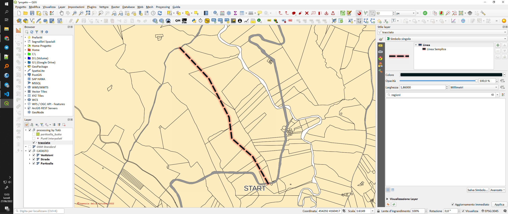

## Modellatore grafico

per realizzare un algoritmo di processing

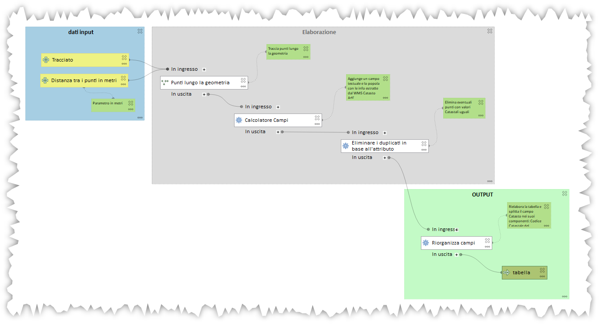

## Disegno CAD Avanzato

Gli snap, topologia

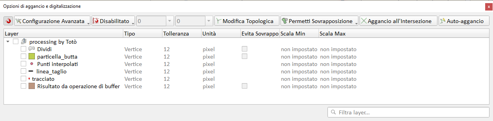

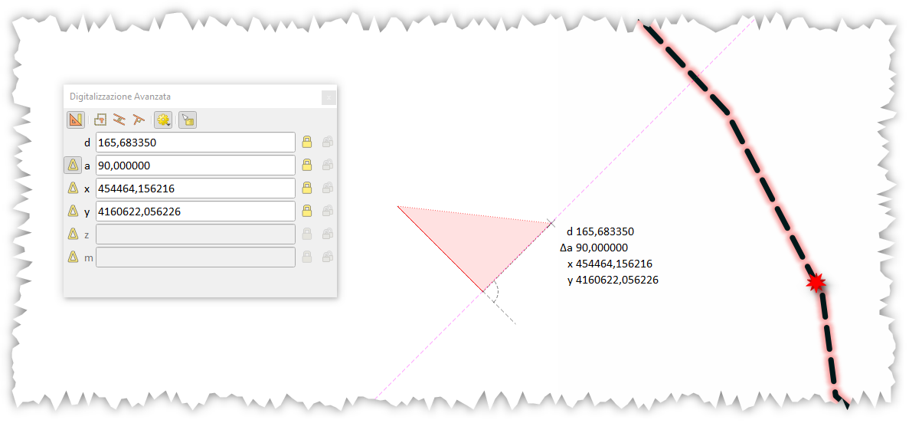

## Plugin Cadastral Divisions

COme effettuare frazionamenti su particelle convesse

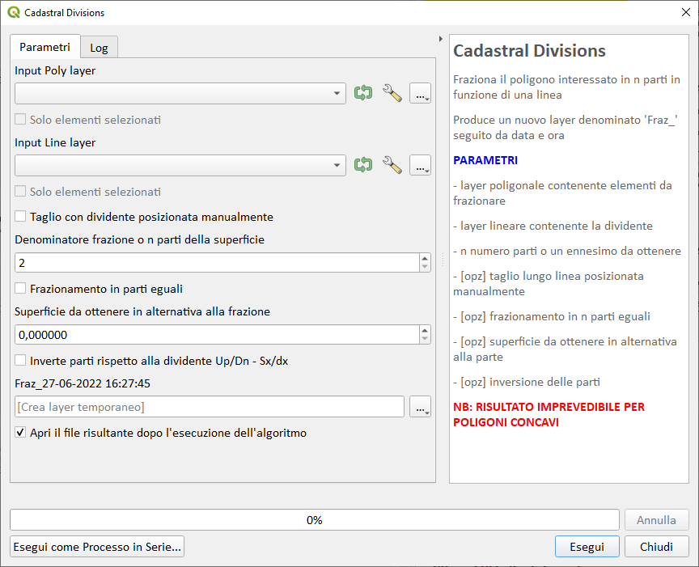

## Stampa

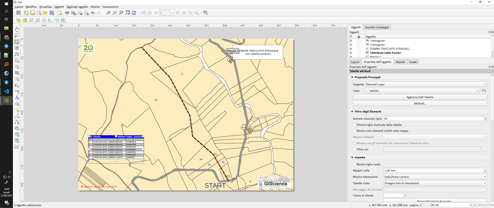

[↑ torna su ↑](#workshop-estate-gis-2022-unipd)

---

# Cosa occorre

Software con caratteristiche minime per seguire con profitto il workshop

## Software da installare

1. [QGIS 3.26 Buenos Aires](https://qgis.org/it/site/) (o maggiore) ;
2. [GIMP 2.10](https://www.gimp.org/) (attualmente GIMP 2.10.24) ;

##  Plugin da installare

1. [GIMP Selection Feature](https://plugins.qgis.org/plugins/gimpselectionfeature_plugin/) ;
2. [Magic Wand](https://plugins.qgis.org/plugins/MagicWand-master/) ;
3. [Nominatim Locator Filter](https://plugins.qgis.org/plugins/nominatim_locator_filter/) 
4. [Cadastral Divisions](https://github.com/Korto19/Cadastral_Divisions) 

[↑ torna su ↑](#workshop-estate-gis-2022-unipd)

# RISULTATI EVENTO

- 650 iscrizioni
- numero massimo partecipanti ZOOM 171

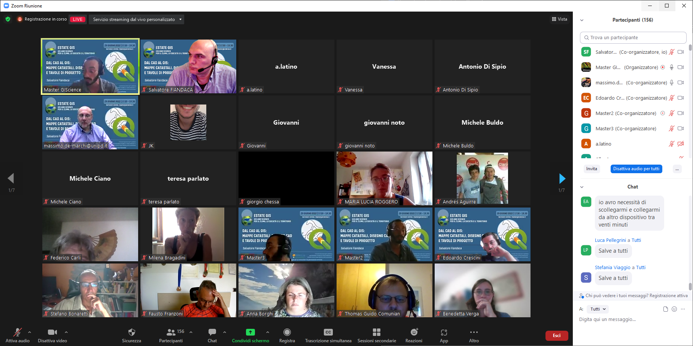

- video Facebook : <https://www.facebook.com/MasterGIScience/videos/1206098126894878>

## DOMANDE

RACCOLTA DOMANDE PARTECIPANTI

DAL CAD AL GIS: MAPPE CATASTALI, DISEGNO CAD E TAVOLE DI PROGETTO (Salvatore Fiandaca)

Da Lorenzo Luisi a tutti 06:12 PM
Ciao Totò, stai effettuando un'attività lecita sul WMS del Catasto. Puoi riassumere perché è lecita e che altro si può fare con la licenza open dell'AdE? Grazie.

Da roberto a tutti 06:34 PM
Buonasera, come potremmo fare per sostituire il codice Belfiore con il nome del comune?

Da Carmelo D'AMICIS a tutti 06:36 PM
Buonasera, è possibile ricercare le particelle nel wms catasto? Se si, come? 

Da Arianna Baldoni a tutti 06:41 PM
se creo una stampa da qgis, posso caricarla ugualmente georiferita su autocad map così come abbiamo appena visto su qgis? 

Da JK a tutti 07:04 PM
con evita sovrapposizione la parte sovrapposta non esiste proprio o va sotto?

Da roberto boschin a tutti 07:05 PM
sarebbero utili le quote lineari sul layout di stampa

Da Elisa Crosilla a tutti 07:07 PM
sono molto interessata al sistema del modello in qgis. vorrei chiedere se ci sono dei tutorial o manuali in merito da consultare per comprendere come funziona. Approfitto per ringraziare totò per le preziose informazioni e per i diversi tutorial sempre molto utili. Complimenti per il ciclo di conferenze!

Da Elisa Crosilla a tutti 07:12 PM
il sistema modello che totò ha fatto vedere per dare dei comandi in serie (l'ha utilizzato per inserire i punti a tot metri, associare i dati catastali, e per eliminare i punti con le stesse info).. è un sistema molto utile se si lavora con molti dati.. mi piacerebbe capire  meglio come si fa a costruire da zero il modello

Da Gabriele Fargione a tutti 07:16 PM
Una volta eseguito il frazionamento su QGIS, come si dialoga con PREGEO?

Da Francesco.Pelullo a tutti 07:18 PM
Segnalo il plugin QAD che aggiunge ulteriori strumenti CAD-like per il disegno in QGIS (mirror, trim etc)

Da vincenzo piergiovanni a tutti 07:19 PM
Sul comando "Abilita strumenti di digitalizzazione avanzata' è possibile ottenere polilinee 3D

Da Antonio Di Sipio a tutti 07:22 PM
si possono estratte le superfici dal wms del Catasto? sia nominali che cartografiche delle particelle?
Da Francesco.Pelullo a tutti 07:23 PM
@Toto': il dato estratto nel campo "foglio" è composto, segnalo che le ultime due cifre (normalmente 00) corrispondo alla sezione del foglio. Quindi, nel tuo esempio, il numero foglio è 089 sezione 'null'

Da Francesco D'Abramo a tutti 07:24 PM
Salve, visto io spessore delle Sue conoscenze su qgis potrebbe accennare il nome di qualche plugin utile all' analisi e all' elaborazione di dati in agricoltura? La ringrazio (spero di non essere uscito troppo fuori tema)

Da Angelo Ballaera a tutti 07:28 PM
Salve, nel compositore di stampa c'è modo di creare un cartiglio?

[↑ torna su ↑](#workshop-estate-gis-2022-unipd)

# Riferimenti utili

- **WorkShop EstateGIS 2021** : <https://github.com/pigreco/workshop-estate-gis-2021>
- **QGIS** : <https://qgis.org/it/site/>
- **Repo QGIS** : <https://github.com/qgis/QGIS/blob/master/README.md>
- **Plugin Gimp Selection Feature** : <https://plugins.qgis.org/plugins/gimpselectionfeature_plugin/>
- **Plugin Magic Wand** : <https://plugins.qgis.org/plugins/MagicWand-master/>
- **Plugin Cadastral Divisions** : <https://github.com/Korto19/Cadastral_Divisions>
- **Nominatim Locator Filter** : <https://plugins.qgis.org/plugins/nominatim_locator_filter/>
- **Consultazione cartografia catastale - WMS** : <https://www.agenziaentrate.gov.it/portale/web/guest/schede/fabbricatiterreni/consultazione-cartografia-catastale/servizio-consultazione-cartografia>
- **GIMP** : <https://www.gimp.org/>
- **Font Trueno** : <https://www.wfonts.com/font/trueno>
- **Visual Style Guide** : <https://www.qgis.org/en/site/getinvolved/styleguide.html#trueno-fonts>
- **Visual Studio Code** : <https://code.visualstudio.com/>
- **OpenDataSicilia** : <http://opendatasicilia.it/>
- **Blog Post di Andrea Borruso** : <https://medium.com/tantotanto/le-mappa-castali-diventano-finalmente-utilizzabili-821db2f84533>
- **slide INTRO** : <https://docs.google.com/presentation/d/1IhFlo7IOwcIEqYo1w1P_07PF-jXm8a5W/edit?usp=sharing&ouid=117726059730187290990&rtpof=true&sd=true>

[↑ torna su ↑](#workshop-estate-gis-2022-unipd)

# Cosa c'è in questo repo

- cartella `imgs` contiene le immagini utilizzate nel progetto .qgs;
- cartella `risorse` contiene i file utilizzati nel progetto, come:
  - geopackage [particelle_WMS.gpkg](https://github.com/pigreco/workshop-estate-gis-2021/raw/main/risorse/particelle_WMS.gpkg);
  - il geopackage contiene due tabelle: la prima si chiama `catasto` la seconda `particelle`;
  - il geopackage contine anche il progetto (`catasto_wms`) che fa uso della tabella `catasto`; la tabella `particella` è vuota, pronta all'uso;
- file `license` è il file che definisce la licenza del repository;
- file `README.md` è questo file, con le info.

[↑ torna su ↑](#workshop-estate-gis-2022-unipd)

# Video demo

Video 1 | Video 2 | Video 3 | Video 4
--------|---------|---------|--------
[](https://youtu.be/Fu-i0zfxndY "Estrarre i dati con il Field Calc di QGIS usando un Punto") | [](https://youtu.be/ujLGbsreqYY "Estrarre i dati catastali a partire da un Poligono") |[](https://youtu.be/GhJwzl8HDs8 "Vettorializzare particelle con il Plugin GIMP Selection Feature") | [](https://youtu.be/DBRHYJOtqFo "Vettotializzare Particelle con il Plugin Magic Wand")

# Licenza

**CC BY 4.0** - <https://creativecommons.org/licenses/by/4.0/deed.it>

[↑ torna su ↑](#workshop-estate-gis-2022-unipd)

## Prossimi eventi

<p align="center"><a href="https://www.mastergiscience.it/2022/05/05/estate-gis-2022/" target="_blank">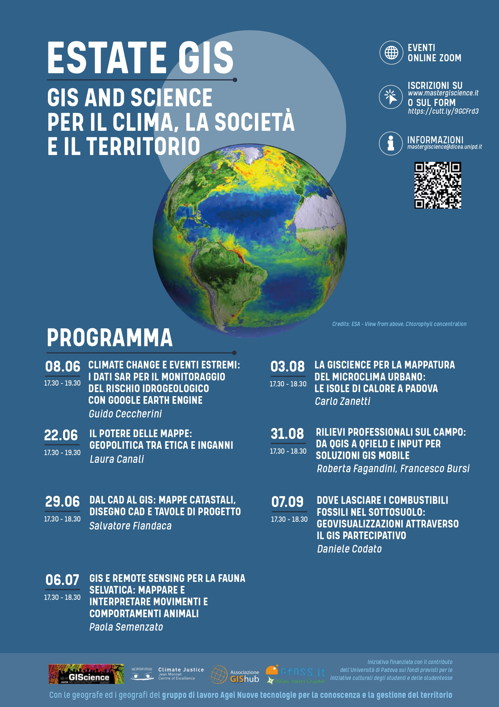</a></p>